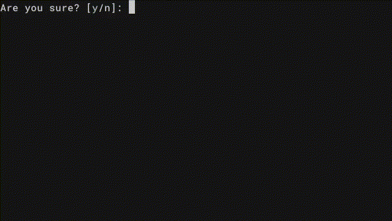

## whale 🐋

**whale** is a lightweight, pluggable Terminal UI for Go.
Named after the Swedish word **“val”** (*choice* / *whale*), it helps you build interactive prompts with lists, confirmations, fuzzy search, and more—effortlessly.

---

## Install
```bash
go get github.com/VincentBrodin/whale@latest
```

---

### Why whale

**whale** is designed to make building Terminal UIs in Go both simple and powerful.
Its modular, pluggable design means you can use only the components you need, with minimal setup and full control.

Here’s why you might choose **whale**:

* [x] **Intuitive API** — Minimal boilerplate with sensible defaults.
* [x] **Non-Intrusive UI** — Doesn’t hijack the entire terminal; integrates cleanly into your existing CLI.
* [x] **Customizable** — Full control over rendering, keybindings, and behavior.
* [x] **Pluggable Components** — Use just the UI elements you need.
* [x] **Fuzzy Search** — Easily enable search in lists for large or dynamic options.

#### Currently Supported Components

* [x] List
* [x] List (Searchable)
* [x] Confirmation
* [ ] Text *Exists as a tool, but not a full ui component (coming soon)*
* [ ] Multi-choice list *(coming soon)*

Whether you're building a CLI tool, a setup wizard, or an interactive script, **whale** helps you keep the interface user-friendly—without cluttering your codebase.

> ⚠️ Note: Currently, whale is deeply tested on Unix-based systems (Linux and macOS). Full Windows support is planned and will be available soon. (This does not mean that it wont work, just that it isn't tested yet)

---

## Usage

### List

The `List` component allows users to scroll through a list of choices and select one. It also supports optional fuzzy searching and full keybinding configuration.


#### Basic Usage

```go
package main

import (
	"fmt"
	"github.com/VincentBrodin/whale/list"
)

func main() {
	items := []string{
		"Apple",
		"Banana",
		"Cherry",
		"Durian",
		"Elderberry",
		"Fig",
		"Grape",
		"Honeydew",
		"Kiwi",
		"Lemon",
	}

	list := list.New(list.DefualtConfig())
	i, err := list.Prompt(items)
	if err != nil {
		panic(err)
	}
	fmt.Printf("User selected %s\n", items[i])
}
```

#### Configuration

You can customize how the list behaves and appears using `list.Config`:

```go
type Config struct {
	Lable string // Text displayed at the top

	AllowSearch bool // Enables search mode
	ViewSize    int  // Max number of items to display at once

	UpKeys     []string // Keys to move up
	DownKeys   []string // Keys to move down
	SelectKeys []string // Keys to confirm a choice
	SearchKeys []string // Keys to enter search mode
	ExitKeys   []string // Keys to exit search mode
	AbortKeys  []string // Keys to cancel/abort the prompt

	// Custom render logic
	RenderItem   func(item string, selected bool, config Config) string
	RenderInfo   func(index, size int, config Config) string
	RenderSearch func(start, end string, config Config) string
}
```

Customize these fields to match your application’s needs—for example, adjusting the `Prompt` text, setting `ViewSize` to limit the number of displayed items,
or defining your own keyboard controls.

### Confirm

The `Confirm` component prompts users to answer between 2 choices [y/n].



#### Basic Usage
```go
package main

import (
	"fmt"
	"github.com/VincentBrodin/whale/confirm"
)

func main() {
	c := confirm.New(confirm.DefualtConfig())
	res, err := c.Prompt()
	if err != nil {
		panic(err)
	}
	if res {
		fmt.Println("User said yes")
	} else {
		fmt.Println("User said no")
	}
}
```

#### Configuration

You can customize how the confirm behaves and appears using `confirm.Config`:

```go
type Config struct {
	Lable string // The text at the top

	TrueOption    string // Most commanly y
	FalseOption   string // Most commanly n
	CaseSensative bool

	AllowDefuatValue bool // Allows the user to not enter anything and the defulat value will be used
	DefualtValue     bool // What the defualt value will be, true or false

	SelectKeys []string // Keys to confirm a choice
	AbortKeys  []string // Keys to confirm a choice

    // Custom render logic
	RenderLable func(config Config) string
}
```
